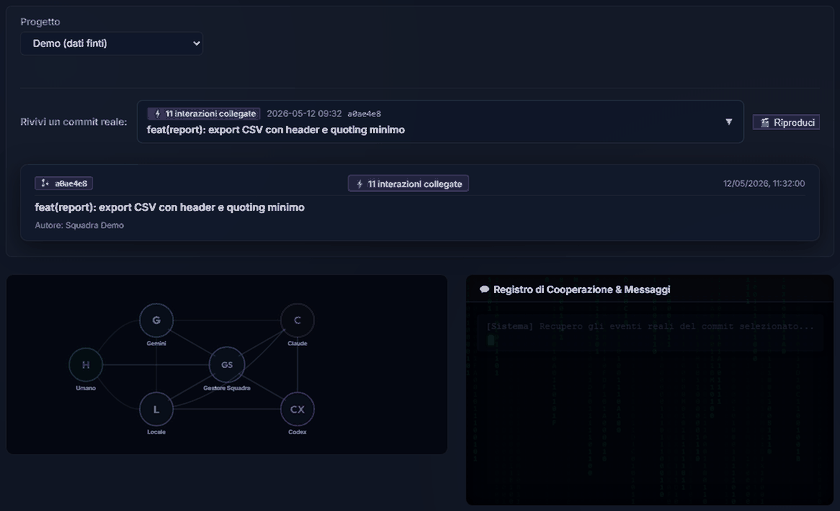
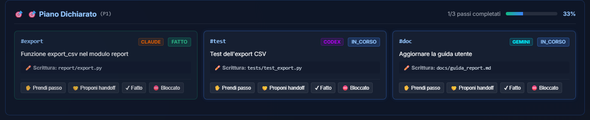
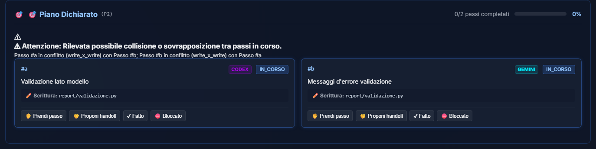
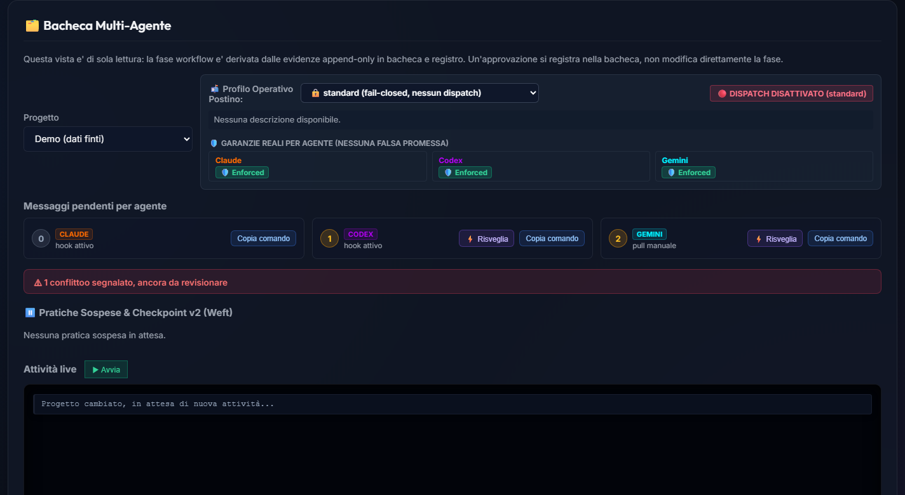

# Squadra — Multi-Agent LLM Orchestrator

**English** | 🇮🇹 [Italiano](README.md)

---

**Squadra** coordinates Claude, Codex, Gemini, a small local model, and a human on the same codebase. It transforms a collection of disconnected chats into a visible process: requests, responsibilities, verification gates, approvals, and outcomes remain tracked and resumeable.

It is not a system that makes decisions for you. It is an operations room: it automates context handoffs and repetitive chores, while critical decisions remain strictly human.

> The goal is not having multiple agents typing at the same time: it is knowing who is doing what, validating the work, and keeping the thread unbroken between sessions.



*Replay of a commit from the demo project: the radial diagram and the Cooperation Log retrace who did what to get there — request, lanes, free local gates, review, human approval.*

## Why Use It

When multiple AI assistants work on the same project, copy-pasting quickly becomes the bottleneck: someone has to remember the context, forward messages, run tests, and reconstruct decisions. Squadra retains that context locally and turns handoffs into an explicit, trackable workflow.

| Without Squadra | With Squadra |
| --- | --- |
| Conversations and decisions scattered across separate tools | Append-only board, structured threads, and resumeable checkpoints |
| The human constantly acts as a manual messenger | The system signals or, if enabled, routes the turn to the right agent |
| Reconstructing a "green test" outcome is difficult | Gates, outcomes, and responsible workers are logged in the audit registry |
| Automation can run unchecked without limits | Whitelist, budget limits, debounce, kill switches, and mandatory human approvals |
| Repetitive routines consume attention or paid cloud tokens | Triage and synthesis offloaded to a free local LLM whenever available |

Commercial agents can use their official CLIs and existing authenticated sessions; the LiteLLM integration remains an optional choice for pay-per-token API providers. The project does not require a single specific vendor, a dedicated GPU, or even an external agent: it degrades gracefully to purely manual mode.

## Features & Capabilities

### A Board, Not Another Chat

`bacheca.py` stores messages, responses, file locks, threads, and verdicts in validated JSONL. A thread can pause awaiting a quality gate or human review, then resume without relying on human memory to reconstruct context. You can monitor pending messages for each worker, inspect locked files, and view global project status.

### Declared Plan: Who Touches What

A thread can carry a **plan with lanes**: steps with an owner and a declared set of files (`write_set`/`read_set`). `bacheca.py piano` creates a step, takes it (atomic compare-and-set: two agents on the same step, the second one loses the race), or offers it to another via a handoff that only transfers on explicit approval. Before an automated dispatch the watcher compares the agent's step against the ones already in progress: if the files overlap it does not dispatch and raises a flag, instead of letting two agents step on the same file. The rule is conservative — a doubt is a block, never a false clearance.

### Delivery States: From Wake-Up to Ownership

A wake-up is not a delivery. For each `(agent, message)` pair the system tracks a progression — `in_attesa` → `attenzione_richiamata` (the watcher acted) → `acquisito_da_hook` (the agent saw it in context) → `preso_in_carico` (it replied) — plus the terminal `chiuso_senza_consegna` when giving up. Events live in an append-only log; the dashboard shows the state next to every pending recipient. An OS wake-up has a cooldown so it doesn't keep stealing focus.

### Local MCP Server: The Board as a Native Tool

`mcp_orchestratore.py` is an MCP server over stdio (no daemon, no port): it exposes the board, the plan, and code notes as **typed tools** that any MCP-capable client — Claude Code, Codex CLI, Antigravity — uses natively. Agents read pending threads and reply without spelling out shell commands; writes are idempotent (an `idempotency_key` makes retries safe). The server calls internal domain functions, never a CLI subprocess, and reuses the same locks. Strictly excluded: arbitrary file I/O, dispatch, Git commands. It does not start turns: it answers tool calls inside a turn already underway.

### Code Notes Anchored to a Block

`note_codice.py` keeps short stickies (gotchas, decisions, conventions) attached to a block of lines in a file. The anchor is path + range + content hash: when that block changes, the note flips from `attiva` to `da_rivedere` instead of lying like a forgotten comment. Notes reach context via hooks: a full overview at session startup, and targeted injection of only relevant notes for the specific file being edited right before modification (`PreToolUse` hook).

### Declared & Verifiable Workflows

The standard lifecycle — task, gate, triage, logging, human approval, and closure — does not just live in documentation: it is structured JSON with a strict schema and validator. This ensures dependencies, produced artifacts, halt conditions, and irreversible actions are verified before execution.

### Quality Built into the Process

The **Sentinel** (`sentinella.py`) executes strictly whitelisted commands. The development gate includes automated tests, linting, type-checking, and complexity checks (Xenon); every result is recorded in the audit log. For ambiguous outputs, `triage_locale.py` can automatically classify routine vs. escalation using a local model; without a local model, deterministic rule checks ensure zero blocking.

### The Postman, With a Profile You Choose Per Project

The dashboard can detect pending messages and focus the target agent's window. How much automation runs is set by an **operational profile per project**, chosen from a dashboard menu rather than scattered toggles: `standard` (no automation, the default for every new project), `brainstorming` (the agent replies on its own in the board, at a limited pace), `super`/`smodata` (file writes too, Git write commands never). Every new project starts in `standard` — automation is always an explicit opt-in, never the default. Even at the fastest pace there is an absolute cap in code, never truly unlimited, and the dashboard honestly states, per assistant, whether a constraint is technically enforced (`enforced`, today only Claude via `--allowedTools`) or only a prompt convention (`prompt_only`, Codex and Gemini) — it never claims the same protection for all three when it isn't real. A dispatch that fails does not make the watcher retry forever: it falls back to the passive wake-up or gives up after a few attempts.

A standalone technical review mode allows an agent to inspect diffs, test logs, and quality gates to report real findings without modifying source files, making git commits, or accessing the network.

### Audit & Replay Instead of Fragile Memory

`registro.py` maintains an append-only, schema-validated event log detailing who did what, gate outcomes, cost estimates, and human verdicts. `commit_replay.py` links a git commit to the exact event sequence that produced it: the dashboard can thus display not just the final result, but the collaborative history behind it.

### Operational Dashboard

A local FastAPI interface centralizes the multi-agent board, suspended workflows, file conflicts, audit logs, and commit replays. The radial handoff diagram visualizes transitions between team members, and the multi-line commit picker lets you replay actual project history.

### Prudent CLI Maintenance

A scheduled checker inspects new releases of Claude, Codex, and Gemini, retrieves release notes, and synthesizes them with the local model. It never updates anything automatically: it opens an informational ticket on the board and waits for human decision.

## Architecture at a Glance

```text
Human  ─┐        ┌─ hook (context) ─┐   ┌─ MCP server (tools) ─┐
Claude ├──► JSONL Board ──► Optional Postman ──► Target Agent
Codex  ┤       │  │  plan with lanes + collision rule
Gemini ┘       │  │  delivery states (in_attesa → preso_in_carico)
               │  └── limits, debounce, cooldown, kill switch
               ▼
         JSONL Audit Log ◄── Sentinel / quality gate / local triage
               │
               └──► Dashboard & commit replay
```

Suggested roles (guidelines, not strict constraints): Gemini for UI and documentation, Claude for services and refactoring, Codex for meticulous review/security/edge cases, local LLM for triage and summaries, human for domain context and irreversible actions.

## Squadra at Work

A thread's declared plan, with three lanes over disjoint `write_set`s and their progress:



When two in-progress steps write the same file, the dashboard flags it — a warning, not a block:



The board panel: operational profile, pending messages per agent, real guarantees and open conflicts:



*(Screenshots come from the demo project `esempi/demo_dashboard/allestisci.py` — fake data, no real conversations.)*

## 5-Minute Quickstart

### 1. Minimum Prerequisites

- Windows and PowerShell (included convenience launchers are PowerShell; Python scripts are portable).
- Python 3.10 or higher (Python 3.11+ recommended).
- Git, if you wish to use commit replay and pre-commit hooks.

No paid AI account is required to use the dashboard, board, registry, or Sentinel gates. Claude Code, Codex, Gemini/Antigravity, and `llama-server` are all modular, optional components.

### 2. Clone and Run Setup Wizard

```powershell
git clone <REPOSITORY-URL> Squadra
cd Squadra
.\setup.ps1
```

The wizard inspects your environment, detects available CLI agents, asks if you wish to enable the local model, installs required Python dependencies upon request, initializes local data stores, and optionally configures git hooks. It writes local configuration to `.env` (never committed).

For non-interactive configuration with detected safe defaults:

```powershell
python .\setup_wizard.py --auto
```

If your Python virtual environment is already prepared and you only need configuration generation:

```powershell
python .\setup_wizard.py --auto --salta-pip
```

### 3. Launch the Operations Room

```powershell
.\avvia_dashboard.ps1
```

The launcher starts FastAPI locally and opens `http://127.0.0.1:8095`. Logs are stored in `dati_locali/dashboard.log` and `dati_locali/dashboard.err.log`.

## Configuration Scenarios

| Scenario | What you enable | What you get |
| --- | --- | --- |
| Human Only | Wizard, dashboard, registry, and gates | Auditable process without any AI providers |
| One or More Agents | CLIs already installed on your machine | Modular board, task assignment, and handoffs |
| Without GPU | `LLM_LOCALE_ABILITATO=false` | Deterministic quality gates; zero local LLM dependency |
| With Local LLM | `llama-server` running on port 8090 | Free, offline triage and synthesis without code editing |
| Headless Dispatch | `brainstorming` profile (or higher) on a project | Limited, auditable automated turns; choose only after verifying prerequisites |
| Board as a native tool | MCP server wired to the clients (`config/mcp.esempio.json`) | Agents read pending items and reply with typed tools, no shell; does not start turns |

### Agent CLIs (Optional)

| Assistant | Detected Wizard Command | Installation / Access |
| --- | --- | --- |
| Claude Code | `claude` | Official Anthropic CLI and authenticated account login |
| OpenAI Codex | `codex` | Official Codex CLI and authenticated account login |
| Gemini / Antigravity | `agy` | Official Antigravity CLI and Google OAuth login |

The wizard does not install third-party CLIs: it detects them and lets you choose whether to include them in the team. For headless dispatch, review the [Postman Dispatch Guide](docs/GUIDA_POSTINO_DISPATCH_HEADLESS.md) first: it requires updated standalone CLIs, initial permissions/trust, and clear awareness of provider quotas.

### Local LLM (Optional)

The recommended setup is `llama.cpp` with a lightweight GGUF model, such as Qwen 2.5 3B Instruct Q4_K_M. Download a compatible `llama.cpp` release for CPU or NVIDIA, then run `llama-server` on port 8090; the wizard automatically checks `http://localhost:8090/health`.

```powershell
.\llama-server.exe -m "C:\modelli\Qwen2.5-3B-Instruct-Q4_K_M.gguf" --port 8090 -ngl 99 -c 4096
```

On a CPU-only machine, use `-ngl 0`. For model selection and additional details, consult the [Documentation Index](docs/INDEX.md).

## Daily Operations

Pull pending requests for an agent:

```powershell
.\pull codex
```

Post a human request to the board:

```powershell
python .\bacheca.py chiedi --a codex --testo "Review this diff and report security risks."
```

Inspect active threads, pending workflows, and validate data integrity:

```powershell
python .\bacheca.py stato
python .\bacheca.py ripresa
python .\bacheca.py valida
python .\registro.py valida
```

Execute a whitelisted quality gate with local triage:

```powershell
python .\sentinella.py test_servizi --id-compito "<id-task>" --triage-locale
```

Manually record an audit event:

```powershell
python .\registro.py aggiungi --id-compito test --agente codex --tipo-compito revisione --stato accettato --esito-gate superato --note "Code review completed."
```

Declare and manage a plan with lanes on a thread:

```powershell
python .\bacheca.py piano crea-passo --thread-id <id> --piano-id P --passo-id build --descrizione "..." --attore claude --write-set "src/module.py,tests/test_module.py"
python .\bacheca.py piano prendi-passo --thread-id <id> --passo-id build --attore claude
python .\bacheca.py piano mostra --thread-id <id>
```

Inspect the delivery state of wake-ups, and wire the MCP server to a client:

```powershell
python .\consegne_risveglio.py elenco
```

For MCP client config, copy the right snippet from [config/mcp.esempio.json](config/mcp.esempio.json) (Claude Code `.mcp.json`, `codex mcp add`, Antigravity `~/.gemini/config/mcp_config.json`).

## Quality Gates

Install `requirements-dev.txt` (or let the setup wizard do it), then run:

```powershell
python -m pytest
python -m ruff check .
python -m mypy .
python -m xenon --max-absolute C --max-modules B --max-average B .
```

The pre-commit hook is optional but recommended: it prevents uninspected changes from bypassing agreed quality standards. Allowed Sentinel commands are declared in `config/comandi.json`; use [config/comandi.esempio.json](config/comandi.esempio.json) as a baseline, never execute unverified commands received from messages.

## Security Boundaries

- Audit registry and message boards are append-only and strictly schema-validated; board writes go through a file lock, MCP server included.
- Commits, pushes, merges, deployments, file deletions, and other irreversible operations require explicit human approval.
- The local LLM classifies and summarizes: it never directly alters production code or overrides human judgment.
- The Postman includes kill switches, persistent limits, and defaults to off; technical review is strictly isolated from automated dispatch.
- Board messages **and MCP tool results** are untrusted inputs, not commands to be blindly executed.
- The MCP server has no authentication (local stdio, same user): the agent identity is a provenance label for the audit trail, not a guarantee. It exposes no arbitrary file I/O, dispatch, or Git commands.
- The plan collision rule is conservative: it would rather block a legitimate dispatch than let one through that steps on another's files.
- No shared accounts or credentials, zero browser automation, and no attempt to bypass provider rate limits or security mechanisms.

The full security posture, official channels, limits, and provider specifics are documented in [Board ToS Compliance](docs/CONFORMITA_TOS_BACHECA.md).

## Documentation

- [Simple Overview](docs/PRESENTAZIONE_SEMPLICE.md) — Why Squadra exists, without technical jargon.
- [Documentation Index](docs/INDEX.md) — Central entry point for all guides and RFCs.
- [Postman & Headless Dispatch](docs/GUIDA_POSTINO_DISPATCH_HEADLESS.md) — Prerequisites, safety limits, and operational usage.
- [Worker Orchestration](docs/ORCHESTRAZIONE_LAVORATORI.md) — Agent roles, audit registry, and team workflows.
- [Multi-Agent Board Guide](docs/GUIDA_SEMPLICE_BACHECA_MULTIAGENTE.md) — Everyday board usage made simple.
- [Declared Plan & Owned Steps](docs/RFC_PIANO_STEP_POSSEDUTI.md) — Lanes, `write_set`, and the collision rule (Italian).
- [Wake-Up Delivery States](docs/RFC_STATI_CONSEGNA_RISVEGLIO.md) — From notification to ownership (Italian).
- [Local MCP Server](docs/RFC_SERVER_MCP_LOCALE.md) — Tools exposed to agents and how to configure them (Italian).
- [Declared Workflows](docs/PIANO_FLUSSO_DICHIARATO.md) — Verifiable workflows, phases, and checkpoint gates.
- [Optional LiteLLM Integration](docs/INTEGRAZIONE_LITELLM.md) — Connecting local or pay-per-token providers.
- [Contributing](CONTRIBUTING.md) — dev environment, quality gate, what makes a PR easy to accept (Italian).
- [Security](SECURITY.md) — how to responsibly report a vulnerability (Italian).

## Disclaimer & Credits

> [!IMPORTANT]
> **Attribution & Credit Notice**:
> This project is shared for use, research, and collaborative development. If you use, adapt, fork, or build upon this codebase (or any part of it) in your own software, tools, or publications, **you are requested to clearly include attribution in your credits** referencing:
> - **Author / Creator**: Paolo Pavesi (`cemifaido`)
> - **Original Project**: *Squadra — Multi-Agent LLM Orchestrator* (Repository: [https://github.com/cemifaido/ORCHESTRATORE_LLM](https://github.com/cemifaido/ORCHESTRATORE_LLM))

---

Squadra does not replace human judgment: it makes it faster, better informed, and fully verifiable.

