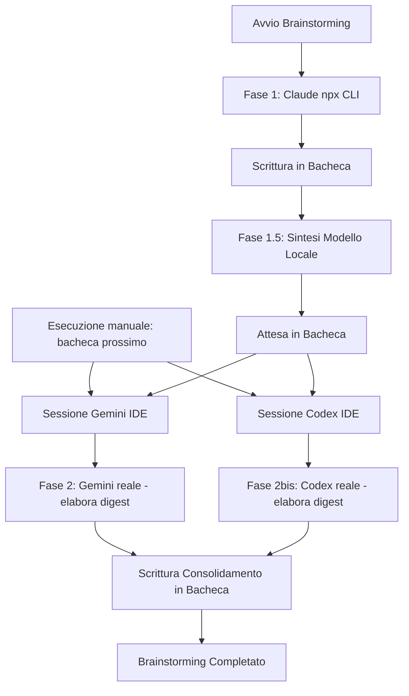

# Piano di Implementazione: Loop di Brainstorming a Tre Voci (Claude Headless <-> Gemini & Codex Pull-based)

**Stato (2026-07-08): Fasi 1 e 1.5 implementate a tre voci con notifica acustica.** `orchestratore_brainstorming.py` (root del repo) invoca Claude headless, sintetizza con il modello locale ed indirizza il risultato a **Gemini e Codex** in bacheca come destinatari paralleli. Al completamento delle fasi automatiche, lo script emette un Beep acustico (winsound su Windows, ASCII bell su altri OS) per allertare l'utente. Testato con successo (149 test totali passati, inclusi 10 unitari specifici). Le fasi per Gemini e Codex rimangono in pull manuale (l'utente lancia `python bacheca.py prossimo --agente <gemini|codex>` per caricare la sintesi nelle rispettive chat).

Questo piano definisce la strategia per implementare un flusso di brainstorming e coordinamento a tre voci, integrando **Claude Code** (headless reale via CLI flat), **Gemini reale** (pull manuale nell'IDE) e **Codex** (pull manuale nell'IDE). La CLI `agy.exe` (Gemini) e la CLI `codex -q` (Codex) rimangono escluse dal background automatico a causa di limitazioni tecniche (bug non-TTY) e di fatturazione (API platform a consumo).

## Note Operative

> [!IMPORTANT]
> **RISERVATEZZA DEI DATI E PRIVACY**: L'API Google AI Studio Free Tier (chiave in `.env`) deve essere considerata **esclusivamente come fallback opzionale per test e simulazioni di debug**. Poiché i ToS del livello gratuito di AI Studio consentono a Google di visionare i prompt e utilizzarli per l'addestramento dei modelli, **ne è vietato l'uso ordinario su codice di produzione sensibile del progetto** per evitare l'IP leakage.
>
> **GEMINI PULL MANUAL-ONLY (STRADA 3)**: A causa del sandbox di sicurezza di Antigravity IDE (che blocca l'esecuzione automatica di comandi locali arbitrari, come verificato al §4.3 della RFC), gli hook automatici come `BeforeAgent` o `PreInvocation` **non scattano**. Pertanto, per preservare la riservatezza e l'identità del piano flat, Gemini partecipa in modalità **Pull Manuale**: all'apertura di ogni sessione l'utente o l'operatore esegue manualmente a inizio compito il comando `python bacheca.py prossimo --agente gemini` ed assimila il lavoro.
>
> **ESCLUSIONE CODEX**: Codex viene configurato in modalità `manual_only` / `pull-based` (§4.3 della RFC) per via dei costi della OpenAI API Platform. Partecipa solo in modalità interattiva all'apertura manuale della chat dell'IDE.
>
> **CONFORMITÀ TOS**: L'interazione in background per Claude avviene tramite la CLI ufficiale `claude -p` (inclusa nell'abbonamento flat), escludendo qualsiasi emulazione di tastiera o jitter temporale. Per la sintesi e il triage intermedi si ricorre al modello locale (Qwen 7B). Questa scelta rappresenta un ulteriore avvicinamento alla soglia del ToS, ma è assolutamente difendibile e comprovata, poiché le invocazioni programmatiche non tentano di camuffarsi ed avvengono in modo trasparente.

> [!TIP]
> **ROADMAP (CLI AGY FLAT HEADLESS)**: La strada maestra a lungo termine rimane l'integrazione nativa headless della CLI ufficiale `agy` per beneficiare del background con abbonamento flat. Si raccomanda di verificare periodicamente gli aggiornamenti di Antigravity CLI (es. lanciando `agy updates`). Non appena verrà risolto il bug non-TTY su Windows/WSL, l'orchestratore in background potrà richiamare direttamente `agy -p` invece dell'hook IDE passivo.

---

## Proposti Cambiamenti

### 1. Modifica del Flusso di Orchestrazione (`bacheca.py` / `orchestratore_brainstorming.py`)
Lo script di coordinamento in background gestisce l'elaborazione di Claude e prepara il contesto. Gemini e Codex si allineano asincronamente tramite pull manuale a inizio sessione:

#### Fasi Dettagliate del Prototipo:
*   **Avvio**: L'utente lancia `python orchestratore_brainstorming.py --argomento "..."`.
*   **Fase 1 (Claude)**: Esecuzione in background di `npx @anthropic-ai/claude-code -p "..."`. Claude elabora la proposta e la scrive in bacheca.
*   **Fase 1.5 (Sintesi Locale)**: Il modello locale (Qwen 7B) estrae un abstract delle idee di Claude per economizzare i token, salvando lo stato in bacheca indirizzato a `gemini` e `codex`. Lo script notifica la fine delle fasi emettendo un Beep di sistema.
*   **Fase 2 (Gemini & Codex Pull Manuale)**: All'avvio delle sessioni interattive nell'IDE, l'utente lancia `python bacheca.py prossimo --agente <gemini|codex>` nel terminale per visualizzare i messaggi pendenti, avviando gli agenti sulle rispettive licenze flat/interattive per elaborare il feedback e consolidare la proposta in bacheca.
*   **Fase 2.5 (Triage Locale)**: Eseguito all'occorrenza sulle risposte degli agenti per convalidare ed evitare loop.

---

## Verification Plan

### Automated Tests — fatto

`tests/test_orchestratore_brainstorming.py`, 10 test, mock su `subprocess.run` e su
`bacheca.litellm.completamento_locale` (nessuna chiamata reale nella suite):
esecuzione Claude riuscita/fallita (binario assente, timeout, codice di uscita non
zero, output vuoto), scrittura dei due messaggi collegati in bacheca (`thread_id`/
`correla_a` coerenti), fallback sul testo integrale quando la sintesi locale non è
raggiungibile, wiring della CLI (`main()`, codici di uscita 0/1).

### Verifica reale end-to-end — fatta

Eseguito `orchestratore_brainstorming.py` con `claude -p` vero (non mockato):
Claude ha risposto, il modello locale ha sintetizzato, il messaggio è stato
correttamente indirizzato a `gemini` nello stesso thread. Nessun test automatico
per la Fase 2 (Gemini): è manuale per design, non c'è un evento automatico da
verificare — l'utente esegue `python bacheca.py prossimo --agente gemini` di sua
iniziativa, esattamente come per qualunque altro thread pendente in bacheca (RFC
§3.5). L'hook `BeforeAgent` **non** va ritestato qui: è già chiuso con esito
negativo in RFC §4.3, e riproporlo senza una nuova prova concreta ripeterebbe
l'errore già corretto in questo stesso piano.
